## Alert #1
**Date:** 2025-09-26T17:26:44+03:00
**Alert Title:** SOC344 - EDR Tampering Attempt via EDR-Freeze
**Severity:** High
**Source IP:** 172.16.20.69 (Local execution via PowerShell)
**Target Host:** WS-Prod-02 (172.16.20.69)
**Delivery IP:** 185.199.111.133 (GitHub CDN - payload delivery)
**External / C2 IP:** N/A (No active C2 connection detected)

**MITRE ATT&CK Mapping:**
* **Defense Evasion:** T1562.001 - Impair Defenses: Disable or Modify Tools
* **Execution:** T1059.001 - Command and Scripting Interpreter: PowerShell
* **Command and Control / Delivery:** T1105 - Ingress Tool Transfer
* **Credential Access:** T1552.005 - Unsecured Credentials: Cloud Instance Metadata Service

**Hypothesis:** An external attacker abused compromised user credentials (`EC2AMAZ-ILGVOIN\LetsDefend`) on `WS-Prod-02` (`172.16.20.69`) to download and execute `EDR-Freeze_1.0.exe` via PowerShell from GitHub CDN (`185.199.111.133`), attempting to suspend local EDR defenses (MITRE T1562.001) and harvest cloud metadata.

**Evidence:**
- **Malicious Payload:** `EDR-Freeze_1.0.exe` (SHA256: `970c7834e58b6ef22473875167a333dbb33bf7b667d1cb814829f68579cd85f7`) confirmed with 54/70 malicious detections on VirusTotal.
- **Delivery Vector:** `powershell.exe` (PID 8) initiated an outbound HTTPS connection to GitHub CDN (`185.199.111.133:443`) at 13:01:30 UTC to fetch the payload.
- **Defense Evasion Execution Chain:** `EDR-Freeze_1.0.exe` (PID 1684) spawned `WerFaultSecure.exe` (PID 6648) with arguments `/h /pid 6080` to freeze/suspend the local EDR agent.
- **Post-Execution Activity:** Outbound network query to AWS Instance Metadata Service (`169.254.169.254`) immediately following execution at 13:03:29 UTC.
- **Scope Verification:** SIEM log analysis confirmed zero internal propagation (no lateral movement) and no other internal endpoints downloaded the payload.

**Classification:** True Positive - Malicious (EDR Tampering & Evasion Attempt)

**Action Taken:** Isolated target host `WS-Prod-02` (`172.16.20.69`) via Endpoint Security, verified network scope to ensure no wider compromise, and documented IOCs (file hash and delivery IP/URL).

**Time to Triage:** 1 hour

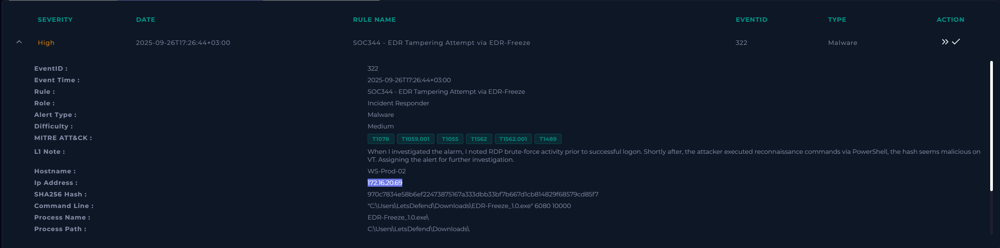

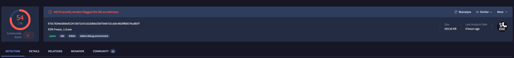
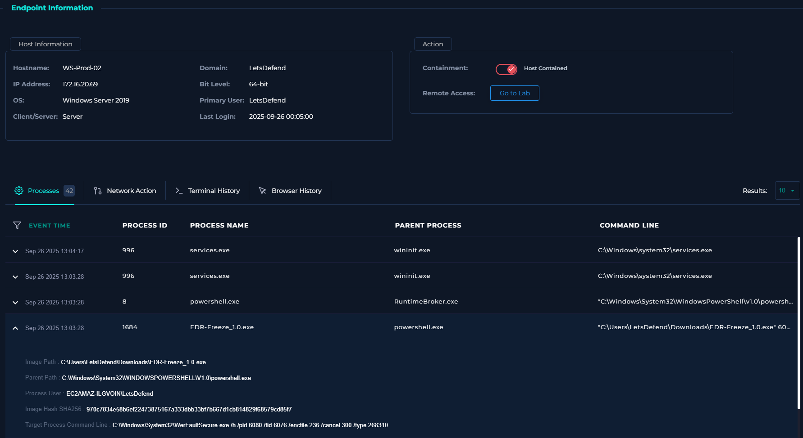
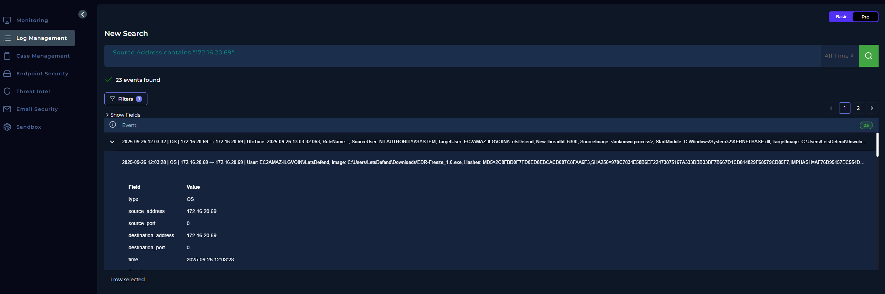
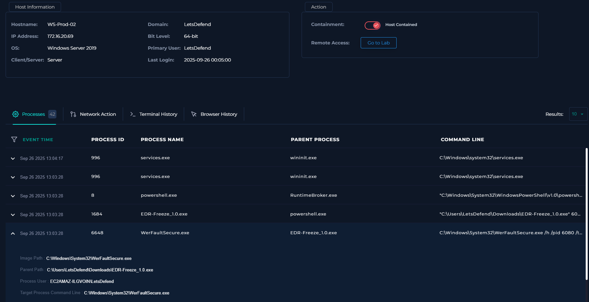
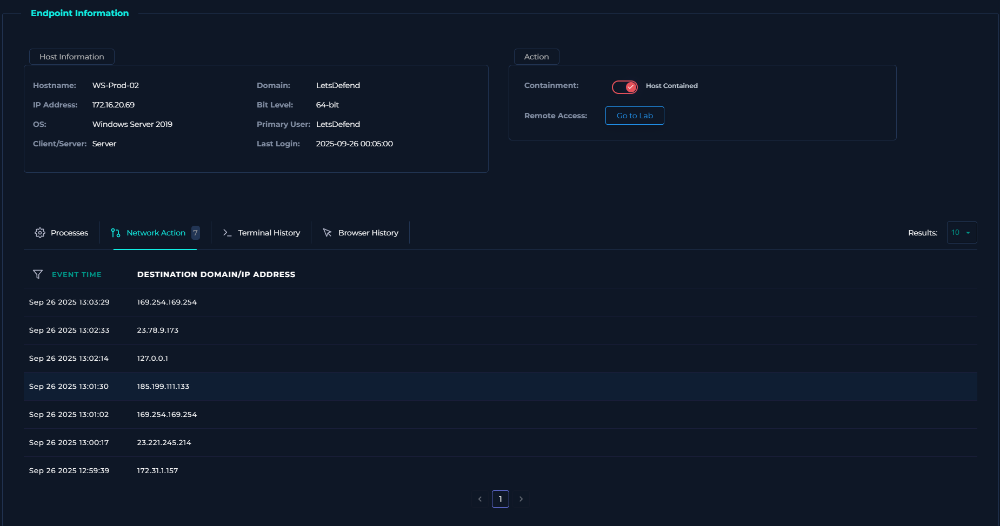
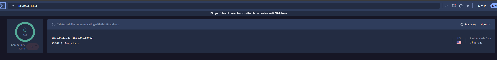
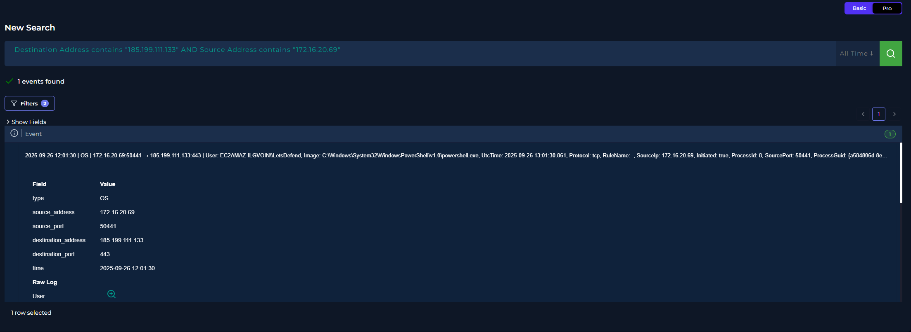

## Alert #2
**Date:** 2025-07-22T13:07:10+03:00  
**Alert Title:** SOC342 - CVE‑2025‑53770 SharePoint ToolShell Auth Bypass and Rces  
**Severity:** Critical  
**Source IP:** 107.191.58.76  
**Target:** 172.16.20.17 (`SharePoint01`)  

**Hypothesis:** An external attacker performed a malicious HTTP POST request against a vulnerable SharePoint endpoint (`_layouts/15/ToolPane.aspx`), successfully achieving remote code execution (RCE) and initiating system reconnaissance activity.

**Evidence:**
- **Web Vector:** Malicious POST request from `107.191.58.76` targeting `172.16.20.17`.
- **Threat Intelligence:** Attacker IP flagged as malicious on VirusTotal (10/89 detections).
- **Post-Exploitation Artifacts:** Execution chain observed: `explorer.exe` -> `cmd.exe /c dir C:\Windows\Temp` -> `powershell.exe -Command Get-Process` for environment and process discovery.

**MITRE ATT&CK Techniques:**
- **T1190** - Exploit Public-Facing Application (Initial Access via SharePoint endpoint)
- **T1059.003** - Command and Scripting Interpreter: Windows Command Shell (`cmd.exe`)
- **T1083** - File and Directory Discovery (`dir C:\Windows\Temp`)
- **T1057** - Process Discovery (`Get-Process`)

**Classification:** True Positive - Malicious (Web Exploit & Reconnaissance)

**Action Taken:** Analyzed request logs and attacker IP reputation, verified process execution artifacts, and immediately isolated target host `SharePoint01` (`172.16.20.17`) via Endpoint Security to prevent further lateral movement. Blocked source IP (`107.191.58.76`) as a malicious indicator (IoC).

**Time to Triage:** 20 minutes

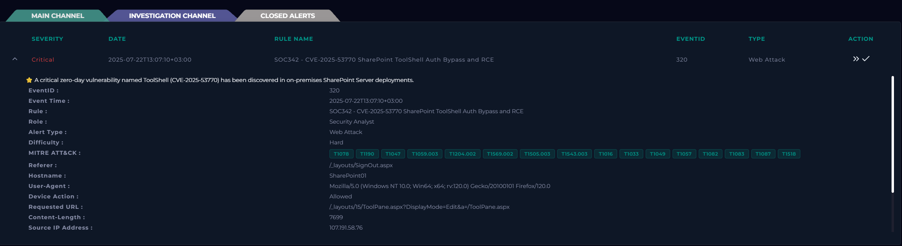

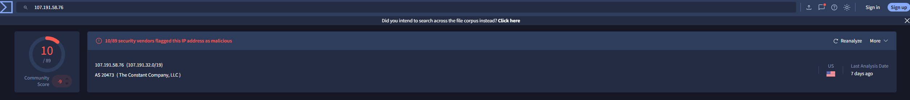
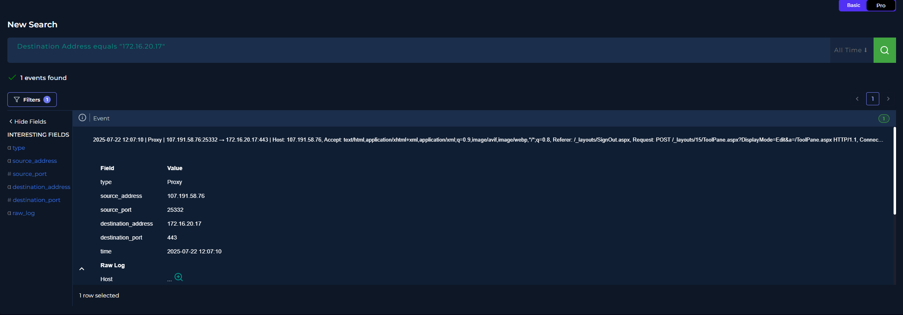
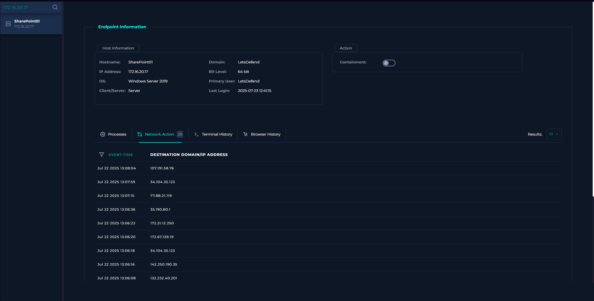
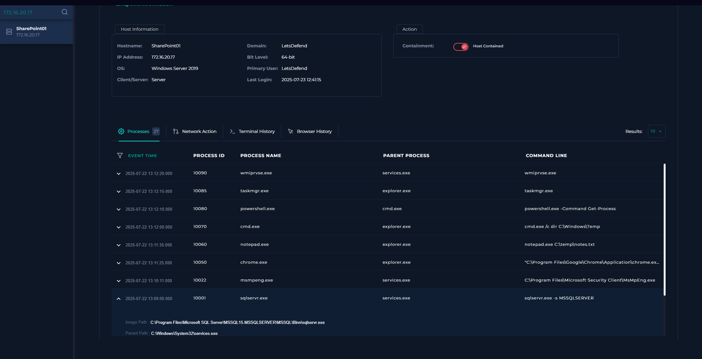